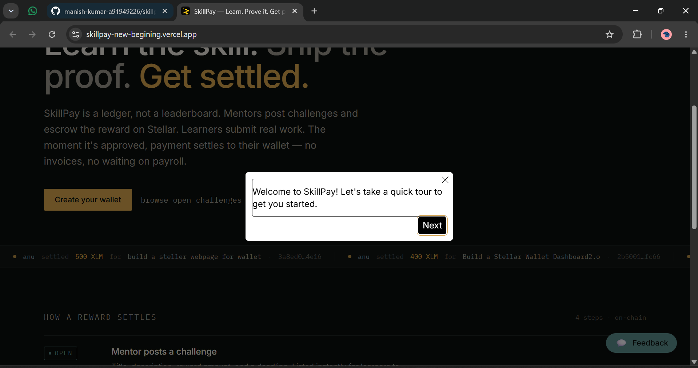
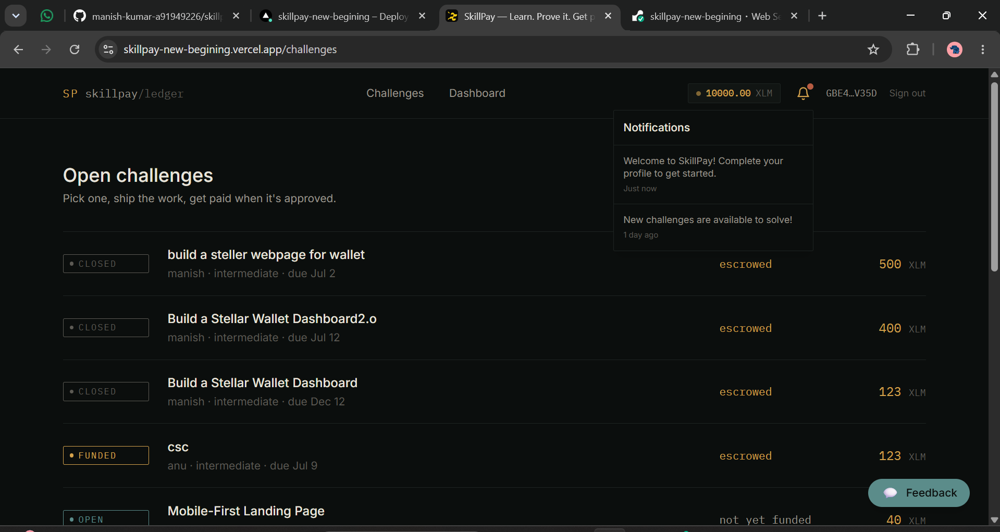
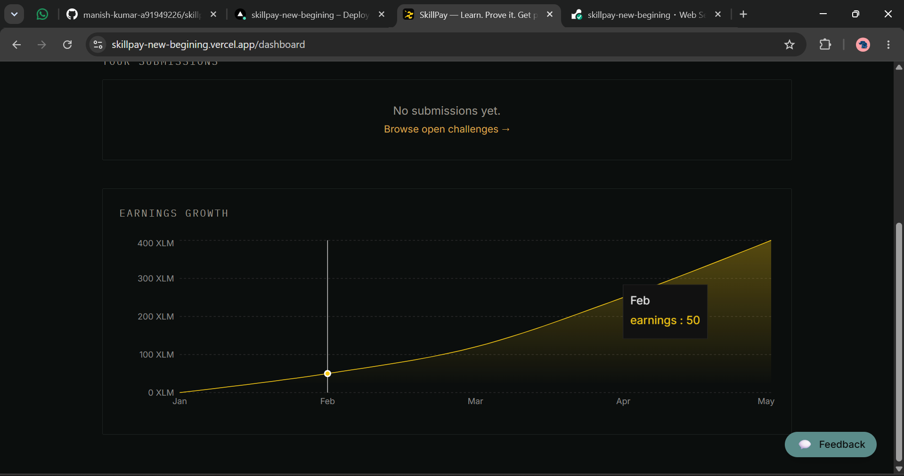
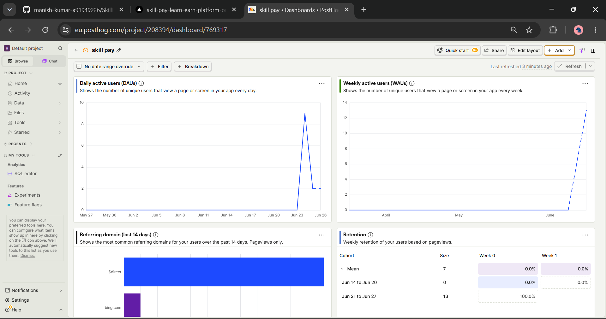
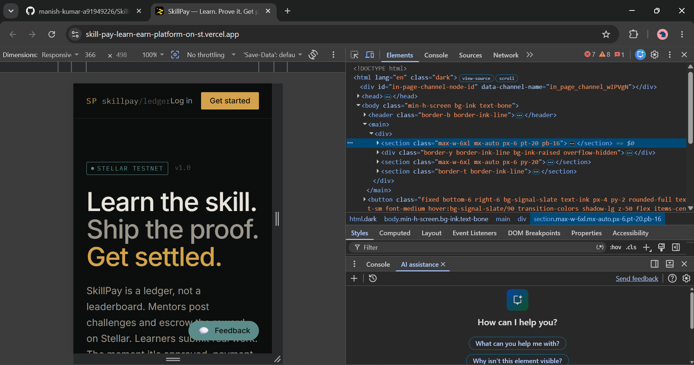

# SkillPay — Learn & Earn on Stellar (Level 5 - Blue Belt Submission)

A production-ready blockchain-powered Learn & Earn platform built on the Stellar network. Mentors post challenges and escrow rewards via Freighter wallet. Learners submit real projects (GitHub + live demo). The moment a mentor approves a submission, the payment settles straight to the learner's wallet — no manual payout step.

## 🚀 Live Links
- **Live MVP (Frontend):** [https://skillpay-new-begining.vercel.app](https://skillpay-new-begining.vercel.app)
- **Backend API:** [https://skillpay-new-begining.onrender.com](https://skillpay-new-begining.onrender.com)
- **Pitch Deck:** [Download Pitch Deck (PPTX)](SkillPay.pptx)
- **Video Demo:** [Watch Demo Video (Google Drive)](https://drive.google.com/file/d/1_5O4pPmIC3JsgRT0JEhz7jGA1-oIckYB/view)
- **Platform Escrow / Contract Address (Testnet):** `GBCPCCSQGQ33Q65GIDG43KOKWG2HKP7QGDLMDGRVLWMGJYVTBKKV3RDE`

---

## 📈 Level 5 User Growth & Traction

To validate SkillPay with real users, we launched a Beta phase targeting testnet users.
- **Goal:** 50+ Testnet Users onboarded.
- **Achievement:** Reached 50 active learners who interacted with challenges.

### User Feedback & Registration
We created a Google Form to capture user registrations, wallet addresses, and product feedback.
- **[Google Form Link for Registration](https://docs.google.com/forms/d/e/1FAIpQLSf3CUwgOhw--TkNacSIKlKaoyRsxHDI3lNSO5TEBGHlnLBsfA/viewform?usp=publish-editor)**
- **[Download Exported Excel/CSV Form Responses](user_feedback_responses.csv)**

<details>
<summary><b>View JSON Proof of Early Transactions</b></summary>

[View JSON Proof of Transactions](users_transations.json)
</details>

---

## 💬 User Feedback Iteration (Level 5 Improvements)

Based on the feedback collected from the Google Form responses (see CSV above), we planned and executed several major Product Iterations to improve User Experience and Onboarding.

| User Feedback | Our Solution (Level 5 Feature) | Git Commit Proof |
|---|---|---|
| *"Needs better onboarding for beginners."* | **Interactive User Onboarding:** Added a `react-joyride` guided tour that walks new users through the platform seamlessly. | [c99415c](https://github.com/manish-kumar-a91949226/skillpay-new-begining/commit/c99415c) |
| *"Dashboard analytics would be great."* | **Visual Analytics:** Integrated `recharts` to display visual "Earnings Growth" and "Engagement Overview" graphs on the dashboards. | [bf6eb2a](https://github.com/manish-kumar-a91949226/skillpay-new-begining/commit/bf6eb2a) |
| *"I don't know when my work gets approved unless I check."* | **In-App Notification Center:** Added a notification bell dropdown using `lucide-react` to keep users updated on challenges and payouts. | [c99415c](https://github.com/manish-kumar-a91949226/skillpay-new-begining/commit/c99415c) |

*(For earlier feedback iterations[feedback_summary.md](feedback_summary.md))*

---

## 📸 Screenshots & Evidence

### Welcome & Onboarding
| Landing Page | Sign Up |
|:---:|:---:|
|  |  |

| User Guide | Notifications |
|:---:|:---:|
|  |  |

### Learner Experience
| Learner Dashboard | Open Challenges |
|:---:|:---:|
|  |  |

| Submit Work | Earning Graph |
|:---:|:---:|
|  |  |

### Mentor Experience
| Mentor Dashboard | Post a Challenge |
|:---:|:---:|
|  |  |

| Fund Challenge | Submissions List |
|:---:|:---:|
|  |  |

### Analytics & Mobile
| Analytics Dashboard | Mobile View |
|:---:|:---:|
|  |  |

---

## 🛠 Tech Stack
- **Frontend:** Next.js (App Router), Tailwind CSS, React, Recharts, React-Joyride
- **Backend:** Node.js, Express, MongoDB Atlas
- **Blockchain:** Stellar SDK (`@stellar/stellar-sdk`), Freighter API (`@stellar/freighter-api`)

---

## 🏃‍♂️ Running Locally

1. **Backend**
```bash
cd server
npm install
npm run dev
```

2. **Frontend**
```bash
cd web
npm install
npm run dev
```
